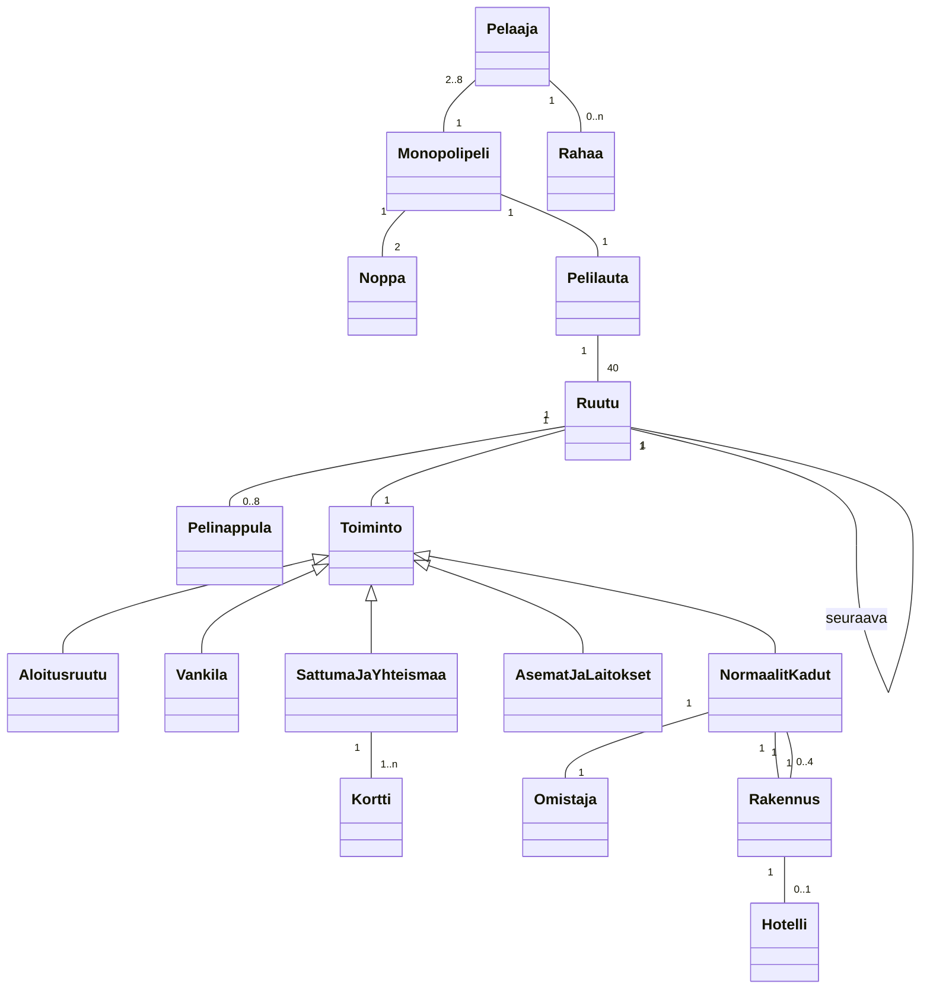

```mermaid
 classDiagram
    Monopolipeli "1" -- "2" Noppa
    Monopolipeli "1" -- "1" Pelilauta
    Pelilauta "1" -- "40" Ruutu
    Ruutu "1" -- "1" Ruutu : seuraava
    Ruutu "1" -- "0..8" Pelinappula
    Ruutu "1" -- "1" Toiminto
    Toiminto <|-- Aloitusruutu
    Toiminto <|-- Vankila
    Toiminto <|-- SattumaJaYhteismaa
    Toiminto <|-- AsematJaLaitokset
    Toiminto <|-- NormaalitKadut
    SattumaJaYhteismaa "1" -- "1..n" Kortti
    NormaalitKadut "1" -- "1" Omistaja
    NormaalitKadut "1" -- "1" Rakennus
    Rakennus "0..4" -- "1" NormaalitKadut
    Rakennus "1" -- "0..1" Hotelli
    Pelaaja "2..8" -- "1" Monopolipeli
    Pelaaja "1" -- "0..n" Rahaa
```
