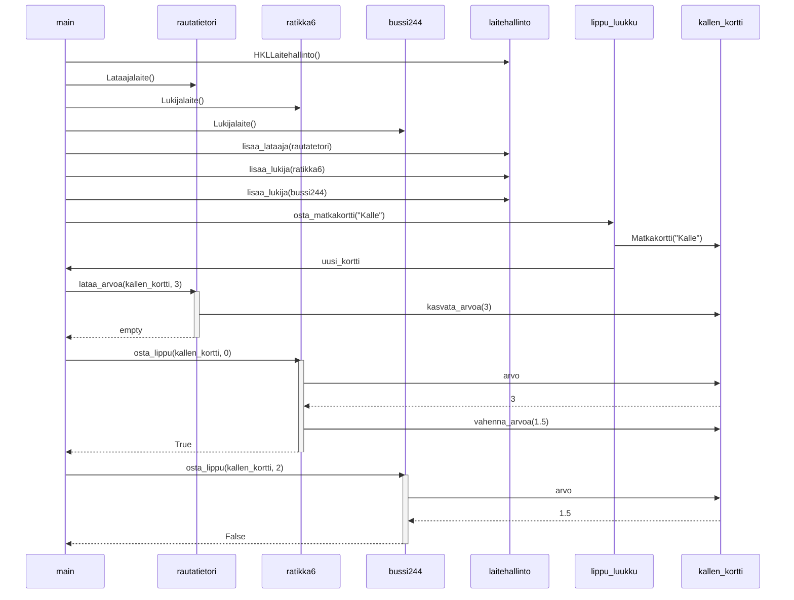

```mermaid
 sequenceDiagram
    participant main
    participant rautatietori
    participant ratikka6
    participant bussi244
    participant laitehallinto
    participant lippu_luukku
    main ->> laitehallinto: HKLLaitehallinto()
    main ->> rautatietori: Lataajalaite()
    main ->> ratikka6: Lukijalaite()
    main ->> bussi244: Lukijalaite()
    main ->> laitehallinto: lisaa_lataaja(rautatetori)
    main ->> laitehallinto: lisaa_lukija(ratikka6)
    main ->> laitehallinto: lisaa_lukija(bussi244)
    main ->> lippu_luukku: osta_matkakortti("Kalle")
    lippu_luukku ->> kallen_kortti: Matkakortti("Kalle")
    lippu_luukku ->> main: uusi_kortti
    main ->> rautatietori: lataa_arvoa(kallen_kortti, 3)
    activate rautatietori
    rautatietori ->> kallen_kortti: kasvata_arvoa(3)
    rautatietori -->> main: empty
    deactivate rautatietori
    main ->> ratikka6: osta_lippu(kallen_kortti, 0)
    activate ratikka6
    ratikka6 ->> kallen_kortti: arvo
    kallen_kortti -->> ratikka6: 3
    ratikka6 ->> kallen_kortti: vahenna_arvoa(1.5)
    ratikka6 -->> main: True
    deactivate ratikka6
    main ->> bussi244: osta_lippu(kallen_kortti, 2)
    activate bussi244
    bussi244 ->> kallen_kortti: arvo
    kallen_kortti -->> bussi244: 1.5
    bussi244 -->> main: False
    deactivate bussi244
```
